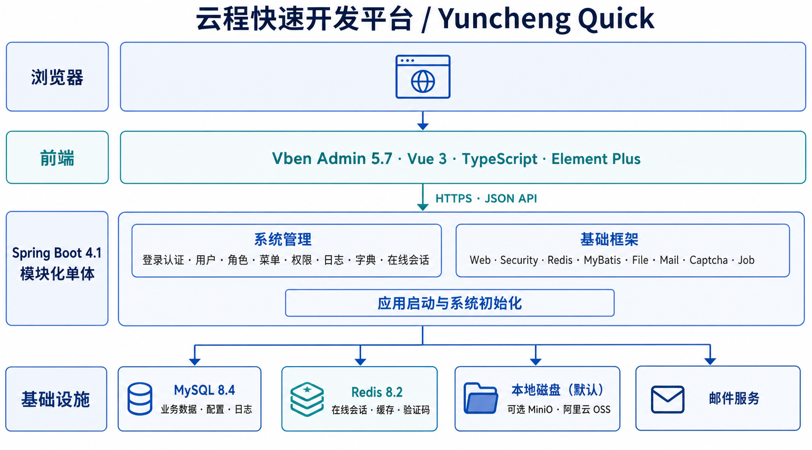

# 云程快速开发平台设计说明

> 项目：Yuncheng Quick
>
> 版本：v0.1.0-alpha.2（开发中）
>
> 更新日期：2026-08-05

本文面向希望了解、评估或扩展云程快速开发平台的使用者，介绍当前版本已经形成的工程结构、核心模块、认证授权模型和运行边界。具体行为以当前版本代码为准。

## 1. 项目定位

云程快速开发平台是一套面向企业管理系统的快速开发框架，提供统一的前后端工程和常用系统管理能力，适合作为内部管理平台、业务运营后台及其他中后台项目的开发基础。

当前版本重点解决以下问题：

- 提供可以直接运行的前后端工程；
- 统一用户、角色、菜单和权限模型；
- 提供登录认证、在线会话和安全策略；
- 统一接口响应、分页、异常和日志处理；
- 提供字典、文件、邮件、验证码、缓存和定时任务等基础能力；
- 为后续业务模块提供一致的代码组织方式。

项目采用单租户模型。需要在企业之间实现完全隔离时，可以通过独立应用、数据库和 Redis 进行部署隔离。

## 2. 总体架构



系统由一个浏览器前端、一个 Spring Boot 后端进程、MySQL、Redis 和文件存储组成：

- 前端负责页面展示、交互、路由和界面权限控制；
- 后端负责身份认证、接口授权、业务处理和数据访问；
- MySQL 保存业务数据、系统配置、文件元数据和日志；
- Redis 保存在线会话、认证状态、可重建缓存和验证码状态；
- 文件内容默认保存到本地磁盘，也可以切换到 MinIO 或阿里云 OSS；
- 邮件服务用于注册、找回密码和个人资料等邮件验证码场景。

后端采用模块化单体结构。不同能力在代码中保持清晰边界，部署时仍作为一个应用运行，降低早期开发、部署和排障成本。

## 3. 技术体系

### 3.1 后端

| 类别 | 技术 |
| --- | --- |
| 语言与运行时 | Java 21 |
| 应用框架 | Spring Boot 4.1 |
| 安全框架 | Spring Security |
| 数据访问 | MyBatis-Plus |
| 数据库迁移 | Flyway |
| 数据库 | MySQL 8.4 |
| 缓存与会话 | Redis 8.2 |
| 构建工具 | Maven |
| 文件存储 | 本地磁盘、MinIO、阿里云 OSS |

### 3.2 前端

| 类别 | 技术 |
| --- | --- |
| 基础框架 | Vben Admin 5.7 |
| UI | Element Plus |
| 应用框架 | Vue 3 |
| 开发语言 | TypeScript |
| 构建工具 | Vite、pnpm、Turbo |
| 状态与路由 | Pinia、Vue Router |
| 列表与查询 | Vben Form、VXE Table |

前端保留 Vben Admin 的工作区、布局、请求、路由和基础组件体系，在应用目录中实现本项目的接口适配和系统管理页面。

## 4. 仓库与工程结构

项目采用前后端同仓管理：

```text
yuncheng-quick
├── .github/                    # GitHub Issue 等平台配置
├── database/                   # 按版本发布的数据库脚本
├── docs/                       # 公开文档和图片
├── server/                     # Spring Boot 后端
├── web/                        # Vben Admin 前端
├── LICENSE
├── NOTICE
├── README.md
├── SECURITY.md
└── THIRD_PARTY_NOTICES.md
```

前后端使用独立构建工具，但共享版本发布、设计说明和开源声明。一个版本标签对应一组可以配合运行的前后端代码。

## 5. 后端模块

后端 Maven 工程位于 [`server`](../server)。

| 模块 | 作用 |
| --- | --- |
| `yuncheng-parent` | Spring Boot 父工程、Java 版本和依赖版本管理 |
| `yuncheng-common` | 公共常量、基础模型和通用工具 |
| `yuncheng-framework` | Web、安全、Redis、MyBatis、文件、邮件、验证码、日志、任务和 OpenAPI 等基础设施 |
| `yuncheng-system-api` | 系统领域对其他模块公开的接口和数据契约 |
| `yuncheng-system-login` | 登录、刷新、退出、注册、找回密码和个人中心 |
| `yuncheng-system-server` | 用户、组织、角色、菜单、权限、日志、字典、安全策略、文件和在线会话 |
| `yuncheng-init` | 管理员、保留角色和系统基础数据初始化 |
| `yuncheng-demo` | 演示扩展模块；当前保留空工程骨架，应用默认不加载 |
| `yuncheng-boot` | 应用入口、配置和 Flyway 数据库迁移 |

`yuncheng-framework` 中的能力按职责拆分为多个子模块，业务模块可以按需依赖，避免通过一个通用模块引入全部基础设施。

## 6. 前端结构

前端工作区位于 [`web`](../web)，当前使用 Element Plus 应用：

```text
web/
├── apps/web-ele/               # 当前前端应用
├── packages/                   # Vben 基础包与公共能力
├── internal/                   # Vben 工程和构建配置
├── scripts/                    # 工作区脚本
└── package.json
```

本项目的业务页面主要位于：

```text
web/apps/web-ele/src/views
```

接口适配主要位于：

```text
web/apps/web-ele/src/api
web/apps/web-ele/src/api/request.ts
```

前端使用 `mixed` 权限模式：

- 系统管理菜单和业务路由由后端按用户权限生成；
- 登录、个人中心和异常页面等基础页面使用前端静态路由；
- 后端返回的权限码用于菜单、按钮和操作入口展示；
- 后端接口授权仍作为最终安全边界。

界面默认使用简体中文，展示时区为 `Asia/Shanghai`。Vben 的主题、页签、布局和基础偏好能力继续用于应用界面。

### 6.1 前端公共组件

业务模块开始开发前需要识别可跨模块复用的界面能力，并在第一次实现时放入应用公共组件目录，不等待第二个模块出现后再迁移。公共组件负责稳定、通用的展示和交互，业务特有的保存规则继续留在业务模块内部。

单列表模块的查询区域采用一行四列布局，第一行展示三个最高频字段，第四列放置重置、查询及展开或收起操作；其他字段默认收起。查询字段不超过三个时不显示展开或收起按钮。左右分栏、选择弹框等宽度受限区域可以按空间改为一行三列、两列或单关键字查询，不要求机械套用单列表布局。

组织能力当前提供以下公共组件：

- `AsyncOrgTree`：当前用于用户管理左侧组织筛选，按父节点异步加载组织树，支持名称或编码关键字搜索；
- `OrgSelectionDialog`：通用组织选择弹框，支持单选、多选、节点类型限制和排除指定子树；
- `OrgSelect`：单组织字段包装组件，通过组织选择弹框完成选择和已选值恢复。

组织管理和用户管理可以使用不同权限的接口，但共享同一套组件和组织摘要契约。组件通过明确的权限场景选择对应接口，不绕过后端权限校验。`/api/orgs/**` 当前只服务用户管理场景，使用用户查询权限；其他业务模块实际需要消费组织时，再按相应模块权限扩展明确的访问场景。

组织树和组织搜索均不分页。树形浏览按父节点异步加载，节点内容点击只执行查询或选择，展开和折叠只响应节点前的箭头；关键字搜索返回完整匹配集合，前端不进行切片假分页，也不展示组织分页控件。表格查询入口对执行期间的新查询进行末次合并，并在当前查询完成后补发；依赖组织筛选等外部条件的列表还需校验请求快照，避免旧条件的数据被解释为当前结果。

## 7. HTTP 接口约定

后端接口统一使用 `/api` 前缀，响应结构为：

```json
{
  "code": 0,
  "data": {},
  "message": "ok"
}
```

当前约定：

- `code = 0` 表示处理成功；
- `code = 1` 表示处理失败；
- `message` 用于返回可展示的结果信息；
- `data` 保存实际响应数据。

分页响应结构为：

```json
{
  "items": [],
  "total": 0,
  "page": 1,
  "pageSize": 20
}
```

前端请求层统一处理响应解包、认证失败和 Access Token 刷新，页面直接使用解包后的业务数据。

### 7.1 OpenAPI 接口文档

平台使用 Springdoc 生成 OpenAPI 3.1 文档，并在现有后台页面中通过 Scalar 提供交互界面。文档只扫描 `/api/**` 业务接口，原始 JSON 和 YAML 端点沿用 Springdoc 的 `/v3/api-docs` 路径，Vite 与 Nginx 将这些端点转发到后端，保证前端按同源方式访问。

接口文档使用独立权限码 `system:openapi:query`。菜单、启用状态接口和原始文档端点均要求用户登录并具有该权限，关闭文档能力时仍保留菜单入口并显示当前环境未启用。开发环境默认开启，生产环境默认关闭，可通过 `PLATFORM_OPENAPI_ENABLED` 显式控制。

OpenAPI Framework 模块集中补充接口分组、Bearer Token 认证方式、通用错误响应和权限码扩展信息。业务接口优先复用已有操作日志名称生成摘要，避免为文档展示批量增加与业务实现重复的注解。

## 8. 用户、角色、菜单与权限

系统采用 RBAC 模型：

```text
用户 ←→ 用户角色关系 ←→ 角色 ←→ 角色菜单关系 ←→ 菜单
```

菜单同时承载导航和权限信息，支持目录、菜单和按钮等类型。角色授权时保存角色与菜单的关系，用户登录后根据角色汇总可访问菜单和权限码。

主要能力包括：

- 用户创建、编辑、启停、删除和密码重置；
- 角色创建、编辑、删除和用户分配；
- 菜单树维护、路由配置和删除影响检查；
- 角色菜单授权；
- 用户动态菜单和权限码查询；
- 权限缓存清理和变更后的缓存失效。

超级管理员和平台保留角色用于维护系统基础能力。普通角色通过菜单和接口权限码获得相应功能。

每个用户至少直接归属于一个组织、部门或小组节点，可以拥有多个归属组织，但有且只有一个主组织。同一用户不能重复绑定同一个直接归属节点，同一组织树中的祖先和后代节点允许同时绑定。

用户和组织通过 `system_user_org` 维护关系。关系只保存直接归属节点和主组织标记，完整路径、所在及顶级组织、部门和小组根据 `system_org` 的当前路径动态推导。组织移动不批量修改用户关系。

用户管理页面使用左侧异步组织树和右侧用户列表。组织筛选支持直属或包含下级、全部组织或仅主组织或仅其他组织；分页查询按用户去重。用户列表单行展示主组织完整路径，用户详情以只读列表展示全部归属组织路径和主组织标记。个人中心通过仅要求登录的个人资料接口返回当前用户自己的归属组织路径摘要，不复用需要用户查询权限的组织选项接口。

归属组织回答“用户属于哪里”，不自动产生数据访问权限。后续数据权限需要独立定义基于主组织、全部归属组织或指定组织节点的授权策略。

## 9. 登录认证与在线会话

系统采用“JWT + Redis 在线 Session”的认证模型。

### 9.1 Web 登录

Web 登录的主要过程为：

1. 前端读取登录安全策略；
2. 根据策略完成图形验证码；
3. 后端校验用户、密码和账号状态；
4. 如果用户被标记为必须修改默认密码，后端只签发短期、专用的改密 JWT，不创建在线 Session，也不签发 Access Token 和 Refresh Token；
5. 前端停留在登录页完成密码修改，修改成功后使用新密码重新登录；
6. 普通登录由后端签发 Access Token 和 Refresh Token，并在 Redis 创建在线 Session 和 Refresh Token 索引；
7. Access Token 返回给前端，Refresh Token 写入 HttpOnly Cookie；
8. 前端加载用户信息、权限码和动态菜单。

Access Token 默认有效期为 30 分钟。Refresh Token 和在线 Session 默认最长有效期为 7 天。

### 9.2 受保护请求

受保护请求经过两层验证：

1. Spring Security 验证 JWT 签名、签发者、接收方、类型和有效期；
2. 后端读取 Redis Session，并加载当前用户状态和权限信息。

因此，账号停用、密码修改或管理员强制下线后，可以通过撤销 Redis Session 使后续请求失效，而不需要等待 Access Token 自然过期。

### 9.3 Token 刷新

Refresh Token 每次使用后都会轮换。前端合并同一页面中的并发刷新请求，后端使用 Redis Lua 完成 Refresh JTI 的原子轮换，并保留短时间 Replay 状态处理跨页签或响应丢失场景。

Web Refresh Token 通过 HttpOnly Cookie 传递。移动端接口使用 JSON 传递 Access Token 和 Refresh Token，并由客户端使用系统安全存储保存长期凭据。

### 9.4 在线会话

在线会话保存在 Redis，不写入数据库。管理界面可以查询会话、查看会话详情并强制下线指定会话。

## 10. 密码与安全策略

用户密码使用 BCrypt 保存，当前强度参数为 10。系统记录有限数量的密码历史，用于限制近期密码重复使用。

系统公共默认密码用于管理员在线新增和管理员重置。安全管理页面只允许重新设置默认密码，不返回或展示现有明文；数据库只保存 BCrypt 摘要。未主动配置时使用程序内置初始值 `user@123456`，管理页面必须明确提示当前仍在使用公开的内置初始值；管理员设置默认密码时需要二次确认。该初始值与管理员初始化密码是两个独立概念，部署方应在首次使用时通过安全管理页面修改公共默认密码。

管理员在线新增和重置用户时可以选择：

- 使用默认密码：管理员无需输入或获知密码，系统设置 `password_change_required` 标记；
- 手动设置密码：密码立即可用，并清除强制修改标记。

系统内置超级管理员初始化和公开注册用户使用各自明确提供的密码，不设置该标记。

被标记的用户通过正确账号密码校验后，不能进入后台，也不能调用普通受保护接口。后端签发默认 10 分钟有效的专用 `pwd-change+jwt`，其中包含改密用途标记、客户端和密码修改版本；改密接口同时检查 JWT 与数据库中的当前标记和密码版本。修改成功后标记清除、旧凭据失效，用户需要重新登录。专用凭据过期或因账号状态、密码版本变化而失效时，Web 登录页清除该凭据并恢复普通登录表单；密码规则或历史密码校验失败时继续停留在改密表单。移动端当前不承载该页面，遇到此状态时提示用户先通过 Web 登录页完成修改。

安全策略覆盖：

- 登录验证码开关；
- 密码长度和字符要求；
- 密码历史检查；
- 系统公共默认密码；
- 登录失败观察窗口；
- 连续失败后的临时锁定；
- 管理员解除登录锁定。

密码修改、管理员重置密码和找回密码会更新密码修改时间，并撤销相关在线会话。

接口权限通过 Spring Method Security 和项目权限码共同实现。前端权限用于改善交互，不能替代后端校验。

## 11. 数据与数据库迁移

MySQL 保存以下主要数据：

- 用户和密码历史；
- 角色、菜单及其关联关系；
- 数据字典和字典选项；
- 组织、部门和小组节点；
- 安全策略；
- 登录日志和操作日志；
- 文件元数据。

应用内置 Flyway 自动迁移能力，运行脚本位于：

```text
server/yuncheng-boot/src/main/resources/db/migration
```

Flyway 在配置中显式设置为默认开启，应用首次连接空数据库时会自动执行建表和系统基础数据初始化，也可以通过配置关闭。当前开发阶段直接维护 V1 完整表结构和 V2 完整基线数据，执行过旧内容的开发数据库需要重建。

仓库根目录的 `database/mysql/<版本>/` 同时提供按发布版本整理的全量脚本和版本间增量脚本，用于手动初始化或升级数据库。已经发布的版本目录保持不变；存量数据库升级时关闭 Flyway，并按版本顺序执行增量脚本。具体使用方式参阅 [`database/README.md`](../database/README.md)。

组织管理在系统领域内维护组织、部门、小组三种节点，支持多个顶级组织、不分页异步树加载、按名称与编码组合查询，以及节点新增、编辑、移动和删除。节点不设置启停状态，使用父节点关系和物化路径同时表达结构；只有名称变化才重建后代节点的完整路径，编码、排序号或说明等普通编辑只更新当前节点。界面按变更范围局部刷新，名称变更和移动等结构性操作刷新树时恢复仍有效的展开节点。用户归属组织在用户管理模块中维护，组织管理页面不承担人员查看。

平台使用固定主键初始化“默认组织”。初始管理员和公开注册用户默认以该节点作为主组织。用户管理新增和编辑必须显式提交至少一个归属组织及主组织。

业务主键使用雪花 ID。部署多个写入实例时，可以通过环境变量为实例配置不同的数据中心编号和工作节点编号。

## 12. 日志

系统提供登录日志和操作日志：

- 登录日志记录登录结果、客户端、IP 和失败原因等信息；
- 操作日志通过注解和 AOP 收集操作类型、请求信息、处理结果和耗时；
- 敏感参数在写入日志前进行清理；
- 日志支持分页查询、详情查看和按保留期限清理。

日志写入使用独立线程池，降低日志数据库操作对主请求的影响。日志任务失败时会记录错误，业务接口不依赖日志写入结果完成主要操作。

## 13. 数据字典与文件存储

数据字典由字典和字典选项组成，用于维护状态、类型等小规模参考数据。公共查询接口返回指定字典的完整选项并携带启停状态，前端新增场景只提供启用选项，编辑场景继续展示已选中的停用选项，历史数据也可以使用停用选项完成翻译。管理接口用于维护字典内容。

字典消费选项使用 Redis 缓存完整列表，空列表同样缓存，TTL 使用一般业务数据档位（当前为 30 分钟）。读取缓存异常时直接回源数据库，不因为非安全类缓存故障阻断业务表单；字典选项新增、编辑、启停和删除后，在数据库事务提交后删除对应字典编码的缓存。缓存失效失败时由 TTL 最终淘汰，不增加消息系统或补偿任务。

文件能力将元数据和文件内容分开管理：

- MySQL 保存文件名称、类型、大小、存储平台和业务关联等元数据；
- 文件内容默认保存到应用运行目录的 `data/files`；
- MinIO 和阿里云 OSS 作为可选存储平台；
- 历史文件按照各自记录的存储平台读取，不依赖当前默认平台；
- 通用附件用于保存私有的文档、压缩包或图片，图片策略用于只允许图片的业务场景；
- 公开文件和受权限保护的文件使用不同访问入口。

## 14. 缓存、异步任务与集群

Redis 主要保存：

- 在线 Session 和 Refresh Token 状态；
- 当前用户、菜单和权限等可重建缓存；
- 数据字典消费选项等业务参考数据缓存；
- 图形验证码和验证码限流状态；
- 集群定时任务锁。

用户、角色、菜单和权限发生变化后，缓存失效操作在数据库事务提交后触发。当前使用独立线程池执行缓存失效任务。

系统日志、缓存失效和平台定时任务使用相互独立的执行资源。定时任务通过 Redis 锁减少多实例重复执行。

进程内异步任务适合日志、缓存失效等可恢复或可重建场景。需要可靠投递、持久化重试或跨服务消费的业务，可以根据实际需求引入独立任务表或消息系统。

## 15. 配置与部署

应用默认使用 `dev` Profile，本地配置支持通过环境变量覆盖。生产部署可以设置：

```text
SPRING_PROFILES_ACTIVE=prod
```

生产 Profile 启动所需的配置包括：

- `DB_URL`、`DB_USERNAME`、`DB_PASSWORD`
- `PLATFORM_AUTH_JWT_SECRET`
- `PLATFORM_INIT_ADMIN_PASSWORD`

其他常用配置包括：

- `REDIS_HOST`、`REDIS_PORT`、`REDIS_PASSWORD`
- `PLATFORM_FILE_DEFAULT_PLATFORM`
- `PLATFORM_OPENAPI_ENABLED`（开发环境默认开启，生产环境默认关闭）
- 文件存储和邮件服务相关环境变量

前端面向当前仍在维护的现代浏览器，最低支持 Chrome 111、Edge 111、Firefox 114、Safari 16.4 和 iOS Safari 16.4。构建和压缩目标统一使用 `es2020`，允许第三方依赖使用这些浏览器已经原生支持的现代 JavaScript 语法（包括 BigInt），不再保留名义上的 ES2015 兼容承诺。

公开仓库中的默认值仅用于本地开发。部署到可联网环境时，应使用独立凭据、HTTPS、访问控制、资源限制、日志保留策略和备份方案。

## 16. 扩展方式

新增业务功能时，可以沿用现有结构：

- 后端按 Controller、Service、Mapper、Entity 和 DTO 组织领域代码；
- 跨模块使用的数据契约放入职责明确的 API 模块；
- 通用基础设施能力放入对应 Framework 子模块；
- 前端页面放入应用 `views` 目录；
- 前端接口按业务领域放入 `api` 目录；
- 菜单、路由和权限码与后端授权保持对应；
- 开发期数据库全量结构维护在 Flyway V1、V2，发布时同步提供独立的全量和增量脚本。

功能规模较小时可以放入现有领域模块；形成独立业务边界后，也可以增加与 `yuncheng-system` 平行的 Maven 模块。

## 17. 当前版本边界

当前 `main` 分支处于 `v0.1.0-alpha.2` 开发阶段，采用以下边界：

- 单租户模块化单体；
- 一个前端应用和一个后端应用；
- MySQL 与 Redis 为基础运行依赖；
- 文件默认使用本地磁盘；
- 当前未提供微服务拆分、租户运行机制和消息队列；
- 提供受登录认证及独立权限码保护的 OpenAPI 3.1 文档，生产环境默认关闭；
- 当前验证方式以编译、类型检查、构建和关键流程人工检查为主。

这些边界描述当前版本的实现范围，不限制使用者在自身项目中扩展相应能力。
